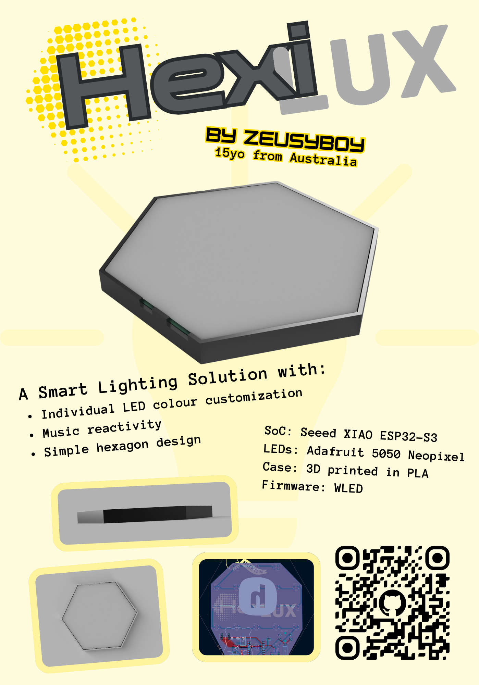
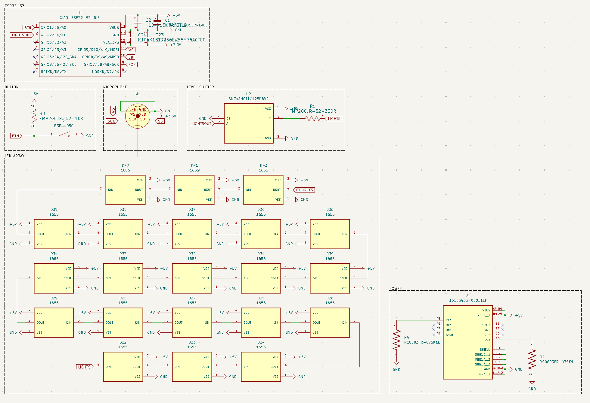
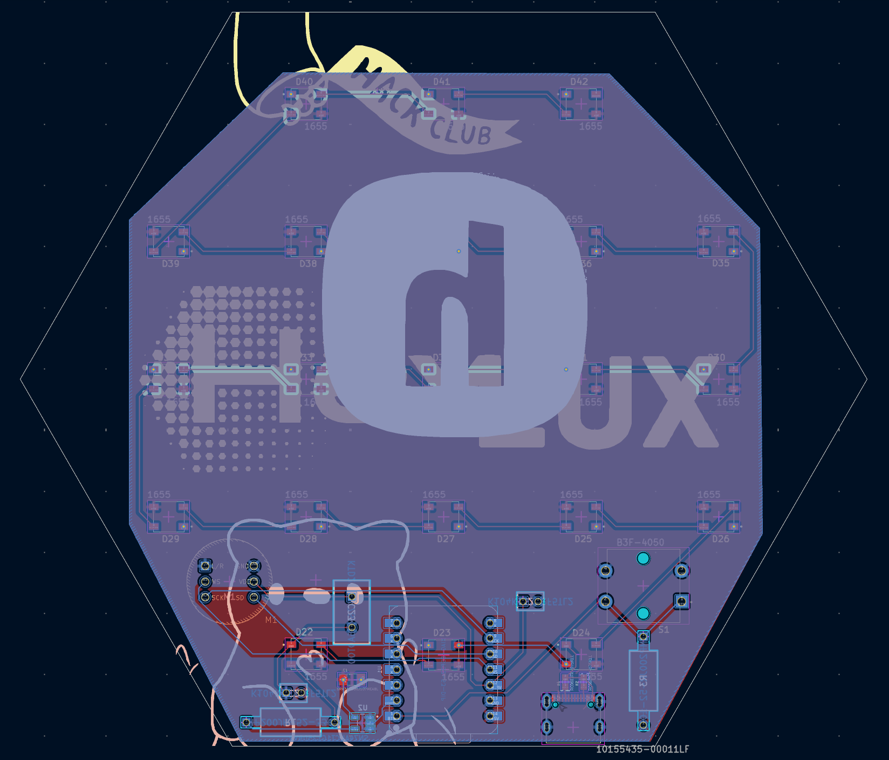
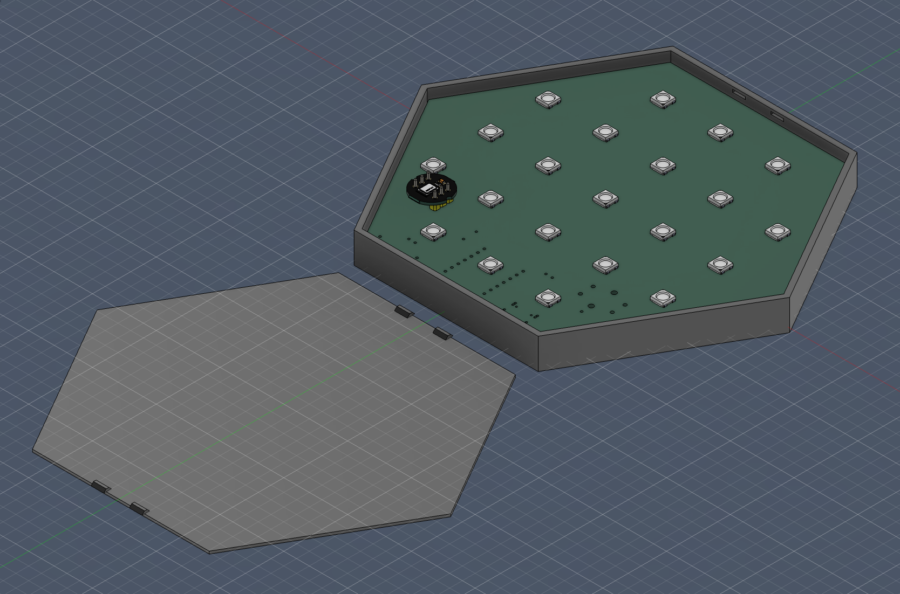

# HexiLux
Made for Hack Club Fallout.

## Zine

## What does it do?
A custom open-source smart lighting solution, using tiling hexagonal panels. Featuring music sync and home assistant compatibility. 

## Why/Motivation?
Because I enjoy DJing and music reactive lights to go behind my setup would be really cool and elevate my experience.

## How?
In order to make this project for yourself, you'll need to purchase/3D print the items in the bill of materials below.

| Quantity | Item               | URL                                                                                                                                                                                                                                    | Unit Price ($USD)   | Total Price ($USD)  |
| -------- | ------------------ | -------------------------------------------------------------------------------------------------------------------------------------------------------------------------------------------------------------------------------------- | ------------------- | ------------------- |
| 1        | Microphone         | [Zaitronics](https://zaitronics.com.au/products/inmp441-i2s-mems-omnidirectional-microphone?variant=51395922100516&country=AU&currency=AUD&utm_medium=product_sync&utm_source=google&utm_content=sag_organic&utm_campaign=sag_organic) | 5.57                | 5.57                |
| 3        | Neopixel (10 pack) | [DigiKey](https://www.digikey.com.au/en/products/detail/adafruit-industries-llc/1655/5154679)                                                                                                                                          | 4.50                | 13.50               |
| 1        | Button             | [DigiKey](https://www.digikey.com.au/en/products/detail/omron-electronics-inc-emc-div/B3F-4050/95200)                                                                                                                                  | 0.52                | 0.52                |
| 1        | Board           | [DigiKey](https://www.digikey.com.au/en/products/detail/seeed-technology-co-ltd/113991114/19285530)                                                                                                                                    | 7.49                | 7.49                |
| 4        | 100nF Capacitor    | [DigiKey](https://www.digikey.com.au/en/products/detail/vishay-beyschlag-draloric-bc-components/K104K15X7RF5TL2/286538)                                                                                                                | 0.28                | 1.12                |
| 1        | 330 Resistor       | [DigiKey](https://www.digikey.com.au/en/products/detail/yageo/FMP200JR-52-330R/2058682)                                                                                                                                                | 0.19                | 0.19                |
| 1        | 10k Resistor       | [DigiKey](https://www.digikey.com.au/en/products/detail/yageo/FMP200JR-52-10K/2058646)                                                                                                                                                 | 0.19                | 0.19                |
| 2        | 5.1k Resistor      | [DigiKey](https://www.digikey.com.au/en/products/detail/yageo/RC0603FR-075K1L/727268)                                                                                                                                                  | 0.10                | 0.20                |
| 1        | 47uF Capacitor     | [DigiKey](https://www.digikey.com.au/en/products/detail/tdk/FK20X5R0J476MN000/2815373)                                                                                                                                                 | 0.86                | 0.86                |
| 1        | 100uF Capacitor    | [DigiKey](https://www.digikey.com.au/en/products/detail/murata-electronics/GRM31CD80J107MEA8L/13904781)                                                                                                                                | 0.44                | 0.44                |
| 1        | Level Shifter      | [DigiKey](https://www.digikey.com.au/en/products/detail/texas-instruments/SN74AHCT1G125DBVR/376028)                                                                                                                                    | 0.14                | 0.14                |
| 1        | USBC               | [DigiKey](https://www.digikey.com.au/en/products/detail/amphenol-cs-fci/10155435-00011LF/11602060)                                                                                                                                     | 0.85                | 0.85                |
|          | Case               | 3D print files in /CAD                                                                                                                                                                                                                 | (3D printing: 1.17) | (3D printing: 1.17) |
| PCB      |                    |                                                                                                                                                                                                                                        |                     | 29.24               |
| Shipping |                    |                                                                                                                                                                                                                                        |                     | 3.70+20+9.52=33.22  |
| Total    |                    |                                                                                                                                                                                                                                        |                     | 93.53               |

### Build Guide:

#### 1. Preparation
Before starting, make sure you have:
<ul>
<li>All components from the BOM
<li>A soldering iron + solder
<li>Tweezers (there are lots of small components)
<li>Flux (helpful)
<li>A 3D printer (or get the printed parts from someone else)
<li>A USB-C cable
<li>A USB-C power adapter
</ul>

#### 2. Soldering
Take your pcb and begin soldering components to it 
Recommended order:
<ul>
<li>SMD Components (resistors/capacitors, neopixels, logic converters)
<li>Microcontroller (Seeed XIAO ESP32-S3)
<li>Through-hole components (resistors/capacitors, buttons, microphone)
</ul>

#### 3. Case
<ul>
<li>3D print the case bottom and top.
<li>Place the PCB into the case bottom
<li>Snap on the case top
</ul>

#### 4. Firmware
<ul>
<li>Plug the middle USB-C port (ESP32-S3) into a computer
<li>Go to https://install.wled.me/
<li>Install the WLED firmware to the board
<li>Unplug
<li>Plug a power adapter into the off-centre USB-C port
<li>Follow the instructions here to start using: https://kno.wled.ge/basics/getting-started/
</ul>

Enjoy your HexiLux panel!

## Renders

## Designing

